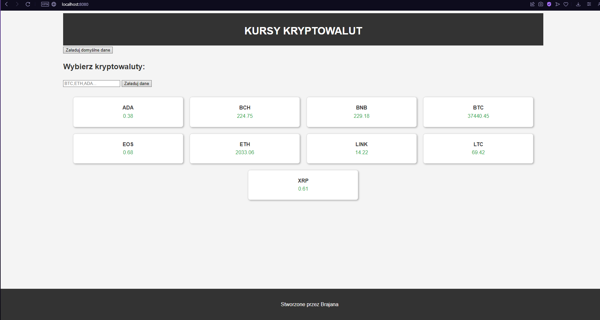

# Cryptocurrency Tracker :money_with_wings: :chart_with_upwards_trend:

Aplikacja webowa do śledzenia aktualnych kursów kryptowalut. Wykorzystuje publiczne API [coinlayer](https://coinlayer.com/) do pobierania danych na temat kryptowalut w czasie rzeczywistym.

## Funkcje :star2:

- Wyświetlanie aktualnych kursów dla 10 najpopularniejszych kryptowalut.
- Możliwość zapytania o kursy dowolnych kryptowalut poprzez wprowadzenie ich symboli.
- Estetyczny i responsywny interfejs użytkownika.
- ## Zrzut ekranu interfejsu użytkownika :camera_flash:



## Technologie :computer:

- **Backend**: Spring Boot z wykorzystaniem RestTemplate do komunikacji z API.
- **Frontend**: Prosta strona HTML z CSS i JavaScript do wyświetlania danych.
- **Deployment**: Aplikacja gotowa do wdrożenia na dowolnym serwerze obsługującym aplikacje Spring Boot.

## Uruchomienie projektu :rocket:

Aby uruchomić projekt lokalnie, wymagane jest posiadanie JDK (Java Development Kit) oraz Maven. Następnie należy wykonać następujące kroki:

1. Sklonuj repozytorium:
2. Przejdź do folderu projektu i zbuduj projekt przy pomocy Maven:
3. Uruchom projekt za pomocą Spring Boot:
    ```sh
    git clone https://github.com/10brajan/RestTemplate.git
    cd twoj-projekt
    mvn clean install
    mvn spring-boot:run
    
4. Otwórz przeglądarkę i przejdź do `http://localhost:8080`.

## Kontrybucje :handshake:

Jeśli chcesz wnieść wkład w rozwój projektu, proszę o tworzenie Pull Requestów lub zgłaszanie problemów w zakładce Issues.

---

Stworzone z :heart: przez [Brajan](https://github.com/10brajan)
